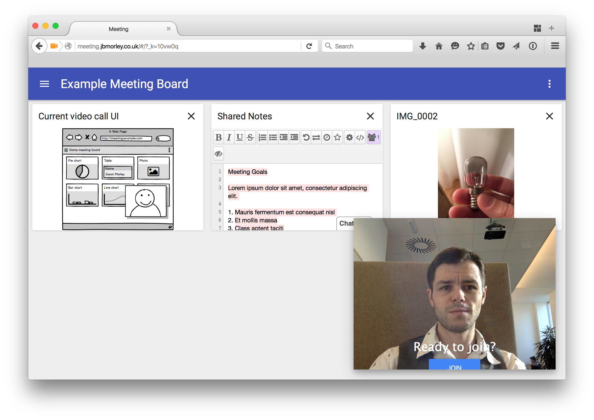

# Meeting

Suite of applications for performing distributed group video conferences and managing shared meeting boards.



## Development

All development thus-far has been performed on OS X. It is anticipated that the same mechanisms described here will also work on Linux systems.

### Dependencies

From the root directory of the project:

```bash
# global requirements
brew install ansible
brew install nodejs
brew install npm
brew install graphicsmagick
brew install ghostscript

npm install -g browserify
npm install -g nodemon

# local requirements
npm install
```

See the [React documentation](http://facebook.github.io/react/docs/getting-started.html#using-react-from-npm) for further notes on installation.

### Configuration

Before you are able to build the project, you will need to create some initial configuration files:

#### WebRTC

WebRTC requires that you provide some STUN and/or TURN (hole-punching and relay respectively) servers in order to negotate a connection.

   To do this, create `src/config.jsx` containing your ICE and TURN server details. For example,

   ```javascript
   module.exports = {
       'iceServers': [
           {
               'url': 'stun:stun.services.mozilla.com'
           },
           {
               'url': 'stun:stun.l.google.com:19302'
           },
           {
               'url': 'turn:relay.inseven.co.uk:3478',
               'username': 'user',
               'credential': 'pass',
           },
       ]
   };
   ```
   
Mozilla and Google host ICE servers but do not provide TURN servers (as these are costly to run). Both the Mozilla and Google STUN servers should be safe to use, but you will need to bring your own TURN server (`relay.inseven.co.uk` does not exist).
    
If you are using [TurnServer](http://turnserver.sourceforge.net), you will need to ensure it is configured with a suitable user in your `turnusers.txt` file (`/etc/turnserver/turnusers.txt` on Ubuntu). For example,
    
```
user:pass:domain.org:authorized
```
    
#### Authentication

Authentication is currently provided using [Passport](http://passportjs.org) which offers plugins for various authentication mechanisms.

This early preview makes use of a simple, local, cookie-based authentication strategy in which users are stored in a JavaScript configuration file. Passwords are not even salted, so this current 
implementation should **never** be used in production.

To set up users, create a new file in `src/lib/config.js` structured as follows:

```javascript
module.exports = {

    name: 'Example Meeting Name',
    secret: 'cookie-secret',
    users: {
        'jason.morley': {
            name: 'Jason Morley',
            password: 'your-plain-text-password-here',
            email: 'jason.morley@example.com',
        },
        'richard.neill': {
            name: 'Richard Neill',
            password: 'your-plain-text-password-here',
            email: 'richard.neill@example.com',
        },
        'piotr.gryko': {
            name: 'Piotr Gryko',
            password: 'your-plain-text-password-here',
            email: 'piotr.gryko@example.com',
        },
    }

};
```

N.B. You will also need to ensure you fill in the `secret` property which is used for encrypting the cookies.

### Building

From the root directory of the project:

```bash
scripts/meeting build
```

### Running

To run the project locally for testing, you can run the development server using the following command:

```bash
scripts/meeting serve
```

This simply runs the `build/service.js` file under `nodemon`. Since this uses `nodemon`, the service will be loaded when the project is rebuilt using `scripts/meeting build`.

### Deploying

#### Ansible

Deployment is performed using Ansible which can be configured in the `ansible` directory.

From the root directory of the project:

```bash
scripts/meeting deploy
```

Meeting currently makes use of upstart to configure Node.js as a service on Ubuntu systems as described in [this article](http://kvz.io/blog/2009/12/15/run-nodejs-as-a-service-on-ubuntu-karmic/).

_The current meeting service is configured to listen on port 3000 so you will likely need to add a firewall exception for this or configure a reverse proxy. Ultimately, it should be possible to change the service port within the Ansible configuration and the default will be set to port 80 as one might expect._

--

1. You can find a reasonable discussion of how this can be configured at [YoLinux.com](http://www.yolinux.com/TUTORIALS/LinuxTutorialApacheAddingLoginSiteProtection.html).
